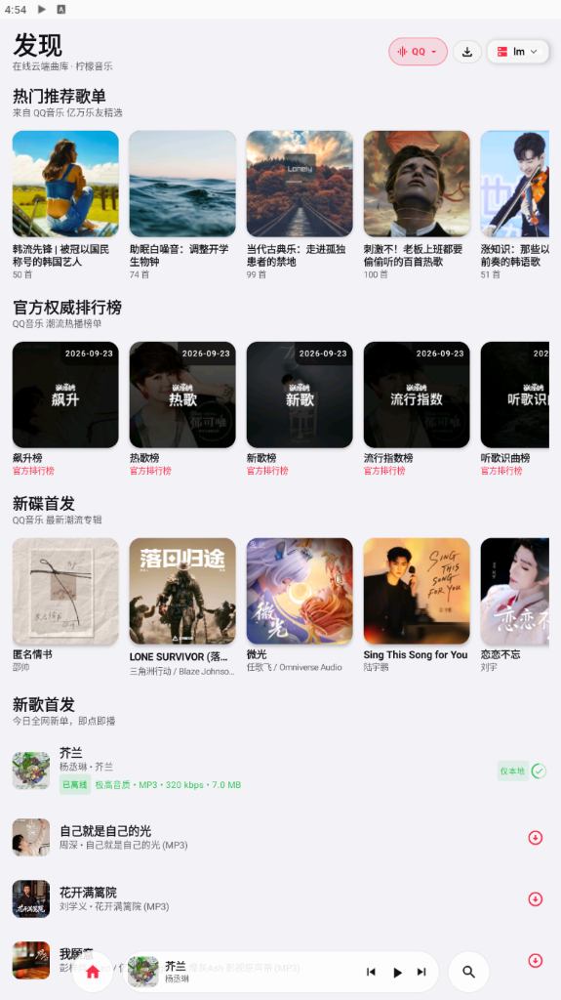
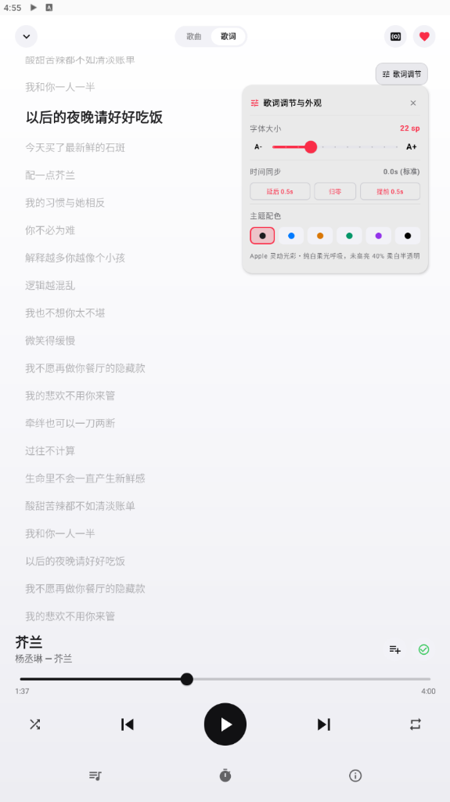
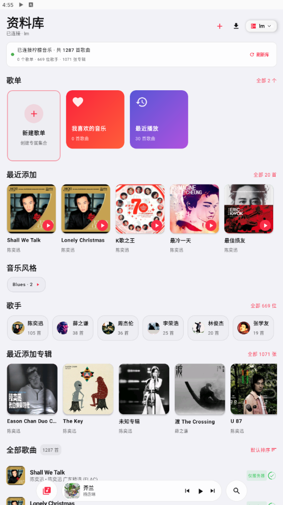
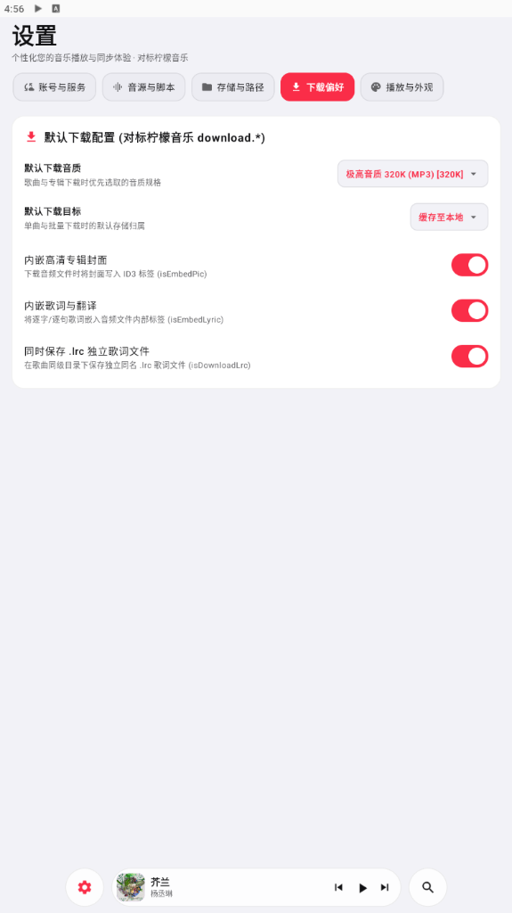
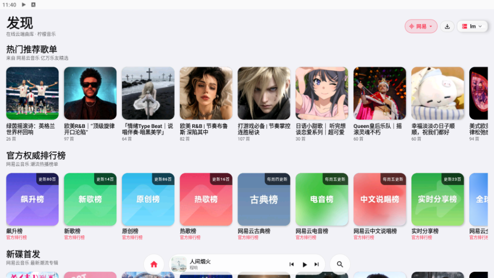
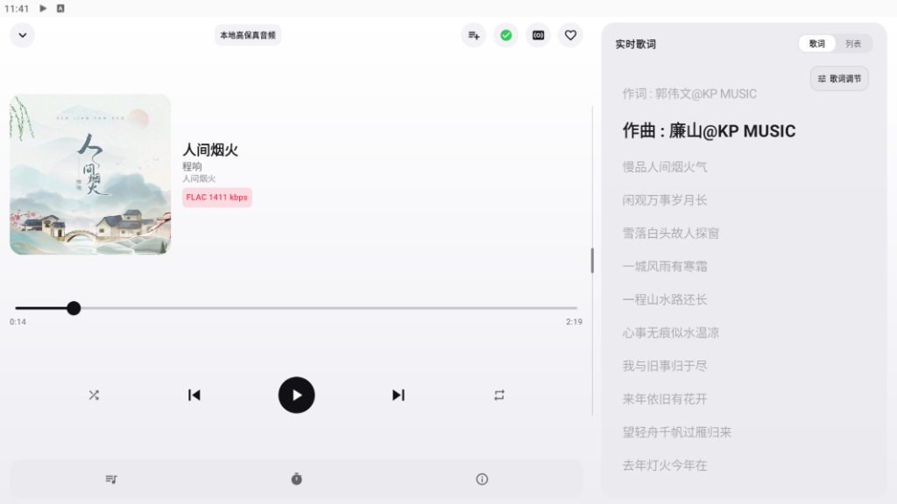
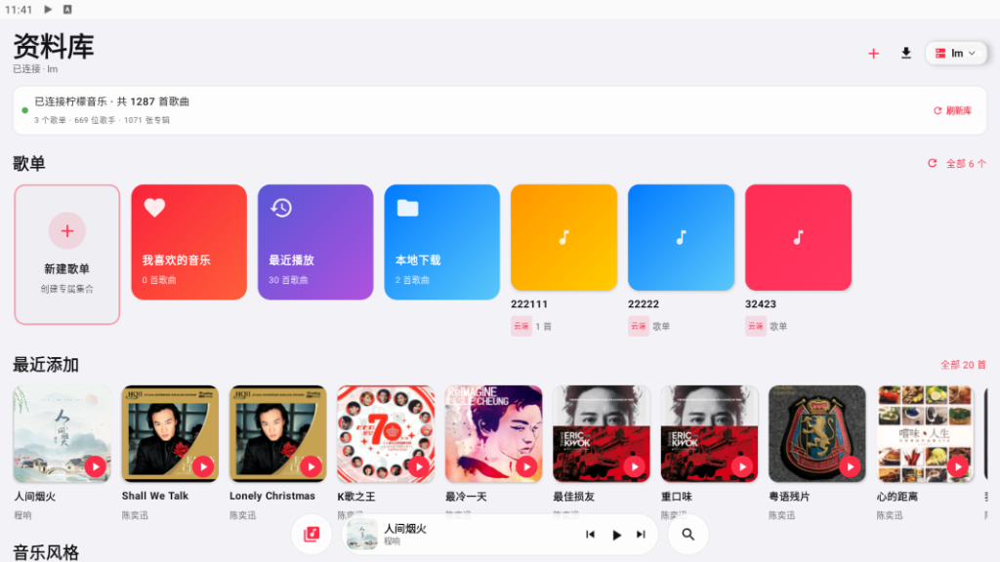

<p align="center">
  
</p>

<h1 align="center">🎵 LMPlayer (柠檬音乐客户端)</h1>

<p align="center">
  <strong>专为车载大屏与 Android 智能设备量身打造的高保真无损音乐播放器</strong>
</p>

<p align="center">
  <a href="https://github.com/zyhub/LMplayer/releases"></a>
  
  
  
  
</p>

---

## 📖 项目简介

**LMPlayer** 是一款面向车机中控大屏与智能手机双端体验深度调优的高保真无损音乐播放器。

项目专属无缝对接 **柠檬音乐 (Lemon Music)** 服务端私有云曲库，并深度融合落雪与主流音源能力（支持 **酷我、网易云、QQ 音乐、酷狗、咪咕** 五大音源全网聚合搜索与试听）。具备本地曲库全盘高速扫描与智能比对、全屏沉浸式超大封面、原位动效歌词微调面板、轻奢级下拉菜单设置中心以及强大的本地已下载歌曲多选批量管理系统。

> 🍋 **配套柠檬音乐服务端仓库**：
> - GitHub 官方仓库：[https://github.com/jia070310/lemon-muisc](https://github.com/jia070310/lemon-muisc)
> - 介绍：专为飞牛 NAS / Linux 原生打造的轻量级音乐后端工具，支持多用户、落雪音源集中托管、在线全网检索与云端私有曲库缓存。LMPlayer 与其 API 深度互通，实现全链路音乐流媒体闭环。

---

## 📸 应用界面截图 (Screenshots)

### 📱 竖屏界面预览 (Portrait UI)

<div align="center">

| 1. 发现 · 在线云端推荐 | 2. 播放器 · 超大高清封面 |
| :---: | :---: |
|  |  |
| **3. 歌词 · 浮层原位调节** | **4. 资料库 · 云端与本地曲库** |
|  |  |
| **5. 设置中心 · 轻奢下拉选择** | |
|  | |

</div>

### 🚗 车载中控大屏与横屏沉浸体验 (Landscape & In-Car UI)

<div align="center">

| 1. 横屏 · 在线发现推荐与权威官方榜单 |
| :---: |
|  |

| 2. 横屏 · 沉浸式高保真播放器与实时双列歌词 |
| :---: |
|  |

| 3. 横屏 · 资料库聚合、歌单与最近添加 |
| :---: |
|  |

</div>

---

## ✨ 核心特性

### 1. 🍋 柠檬音乐云端专属对接
- **私有云互联**：深度对接 [lemon-muisc](https://github.com/jia070310/lemon-muisc) 柠檬服务端，同时兼容 Subsonic、Navidrome 等协议；
- **云端歌单与收藏同步**：实时同步个人专属歌单、历史播放记录与红心喜欢曲目；
- **服务器保存路径控制**：支持动态读取并切换服务端存储与下载目录。

### 2. 🌐 五大在线音源融合与无损试听
- **全网多源聚拢**：融合集成 **酷我 (KUWO)、网易云 (NETEASE)、QQ 音乐 (QQ)、酷狗 (KUGOU)、咪咕 (MIGU)**；
- **分网试听音质**：独立支持 Wi-Fi 与移动流量状态下的试听音质偏好（128K、320K、FLAC、Hi-Res）；
- **智能容灾换链**：在线播放遇到音源限制时自动尝试备用源，保障流畅无感切歌。

### 3. 🏷️ 本地下载音频标签、高清封面与同步歌词内嵌 (v1.5.0 新增)
- **ID3v2.3 规范内嵌 (MP3)**：写入标准 TIT2 歌名、TPE1 歌手、TALB 专辑、APIC 高清封面图以及 USLT 同步/非同步 LRC 滚动歌词；
- **FLAC 官方规范内嵌**：注入标准 VORBIS_COMMENT (`TITLE`, `ARTIST`, `ALBUM`, `LYRICS`) 与 METADATA_BLOCK_PICTURE 封面图；
- **伴随 .lrc 独立歌词文件生成**：下载时自动在歌曲同级目录输出同名 `.lrc` 文件，删除歌曲时联动清理；
- **存量历史歌曲一键补全**：在下载管理中提供单曲「重新内嵌封面与歌词」以及看板「补全全部标签」快捷操作，断网离线、车载车机、U盘与第三方播放器完美兼容！

### 4. 📥 本地已下载歌曲深度管理
- **本地下载存储看板**：直观展示已下载歌曲总数、音频占用磁盘大小及设备剩余可用空间；
- **多选批量管理**：支持一键进入批量编辑模式，快速全选、反选，实时统计选中大小并支持二次确认批量物理删除；
- **存储详情与路径复制**：查看本地绝对存储路径并支持一键复制到剪贴板，详尽展示文件大小、格式与码率规格。

### 5. 🎵 极致播放与交互美学
- **超大专辑封面展示**：竖屏自适应满幅大图，横屏双列对称视效，高精度纹理采样；
- **喜欢按钮 0ms 反馈**：点按喜欢按钮瞬间点亮红心，双向同步 Room 数据库与远程服务端；
- **歌词调节浮层展出**：告别全屏阻塞弹窗，以原生 DropdownMenu 浮层卡片调节字号、时间同步与 6 套 Apple Music 灵动主题；
- **轻奢级全量下拉选择**：设置中心所有配置（音源、音质、目标、外观）全面升级为精致下拉菜单。

### 6. 🔄 账号与服务原生在线更新
- **GitHub 自动通道**：设置页「账号与服务」直通 GitHub 官方 Releases 仓库；
- **一键静默检测与升级**：在线解析最新版本与更新日志，内置断点下载进度条并自动唤起系统安装器。

---

## 🛠 技术架构与选型

| 模块 | 技术选型 | 说明 |
| :--- | :--- | :--- |
| **开发语言** | Kotlin 1.9+ | 现代、简洁、空安全 |
| **UI 框架** | Jetpack Compose + Material 3 | 声明式响应式界面架构 |
| **音频引擎** | AndroidX Media3 ExoPlayer | 高保真硬件加速解码，支持本地/网络双流缓冲 |
| **元数据引擎** | 纯 Kotlin 原生标签处理器 | 零外部依赖解析并内嵌 ID3v2.3、FLAC Vorbis Comment 及 MP4 ilst |
| **网络通信** | OkHttp 4 + Retrofit 2 | 连接池复用、SSL 双向兼容、流式断点续传 |
| **本地持久化** | Jetpack Room (SQLite) | 结构化存储歌曲元数据、歌单、下载任务与服务配置 |
| **图片加载** | Coil Compose | 异步内存三级缓存、圆形裁切、高斯模糊特效渲染 |

---

## 📦 下载与安装

您可以从 GitHub 官方 Releases 页面获取最新版预编译 APK：

👉 **[前往下载最新发布版 APK](https://github.com/zyhub/LMplayer/releases)**

- 最新版本：`v1.5.5`
- 架构支持：`armeabi-v7a`, `arm64-v8a`, `x86`, `x86_64` (通用全架构)
- 最低系统要求：Android 8.0 (API Level 26) 及以上车载车机或智能手机

---

## 💻 本地源码构建指南

### 环境要求
- **Android Studio**：Ladybug (2024.2.1) 或更高版本
- **JDK**：OpenJDK 17
- **Gradle**：8.7+

### 构建步骤
```bash
# 1. 克隆代码仓库
git clone https://github.com/zyhub/LMplayer.git
cd LMplayer

# 2. 编译 Release 正式安装包
./gradlew assembleRelease

# 3. 输出产物位于:
# app/build/outputs/apk/release/app-release.apk
```

---

## 📄 开源许可证

本项目基于 [MIT License](LICENSE) 开源，欢迎提交 Issue 与 Pull Request 共同完善 LMPlayer。
